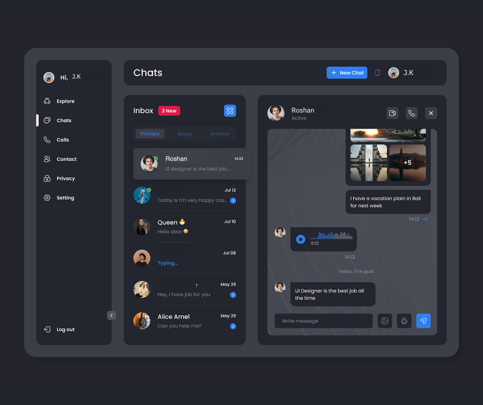

# Chat Messaging App README

> [Follow or Connect me](https://www.linkedin.com/in/jagan-kumar-hotta-502a76270/)

# Overview

Welcome to our Chat Messaging App, built using the MERN (MongoDB, Express, React, Node.js) stack. This messaging app aims to provide users with a seamless and interactive platform for real-time communication. Users can exchange text messages, media files, videos, and audio clips in a secure and user-friendly environment.




# Features

 User Authentication: Users can create accounts, log in securely, and manage their profiles.
 Real-time Messaging: Instant messaging capabilities to facilitate real-time conversations between users.
 Media Sharing: Users can share images, videos, and audio files during chat sessions.
 Message History: Retain chat history to allow users to view previous conversations.
 Responsive Design: Mobile-friendly and responsive design to provide a consistent user experience across devices.

# Technologies Used

 Frontend: React for the user interface design and functionality.
 Backend: Node.js and Express for server-side logic and API development.
 Database: MongoDB for storing chat data and user information.
 Socket.io: Real-time communication through WebSockets for instant messaging.
 Third-party APIs: Integration of third-party APIs for additional features and services.

# Setup Instructions

Clone the Repository: Clone the project repository to your local machine.
```git clone <repository-url>```

Install Dependencies: Navigate to the project directory and install the necessary dependencies.
```npm install```

Configure Environment Variables: Create a .env file and set up environment variables, including database connection details and API keys.

Start the Application: Launch the application by running the appropriate command.
```npm start```

Access the App: Open your browser and navigate to the specified URL (e.g., http://localhost:3000) to access the Chat Messaging App.

# Future Enhancements

Encryption: Implement end-to-end encryption for secure messaging.
Notifications: Integrate push notifications for new messages and updates.
Group Chat: Add functionality for users to create and participate in group chats.
File Management: Enhance file sharing capabilities with file storage and management features.
We look forward to your feedback and suggestions for improving the Chat Messaging App. Enjoy seamless communication with our real-time messaging platform!

## Thank you for using our Chat Messaging App.

# The Project Team
